# PlaySuite

PlaySuite is one native C++20 / GUI.Forms application holding a collection of games. Every game lives in its own folder under [`games/`](games), and the collection is discovered from those folders: adding a game is adding a folder.

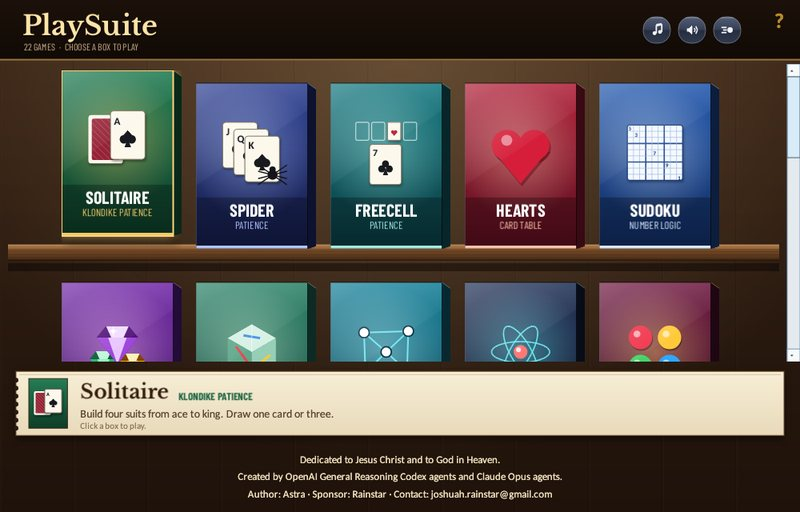

The main menu is a shelf of boxed games in a walnut-panelled shop, in the manner of a 1990s games collection. Every game has its own box; there are no categories. Click a box to open it with a short box-to-window transition; arrow keys select a box and Enter opens it. Inside a game, a floating command capsule at the top holds the way back to the shelf, the game's name and New game; hovering opens it to the game's other commands (Undo, Hint, Options, Top scores and so on) and the master Music, Sound and Motion switches. The `···` button keeps it open. The window resizes down to 600 × 420 and every view lays itself out for small screens.

## The games

<!-- games:start (generated by tools/make_readme.py; edit games/<id>/about.md instead) -->
PlaySuite has **22 games**: Solitaire, Spider, FreeCell, Hearts, Sudoku, Gems, Nature Cube, Untangle, Atom Probe, Four Pegs, Switchbox, Puzzle Solve, Eggy, Koi-Koi, The Parrot's Table, Liar's Dice, Pen the Sheep, Rock Stack, Catching Thieves, Maze 95, Stillwater and Mowing.

<table>
<tr>
<td width="50%" valign="top">
<a href="games/solitaire">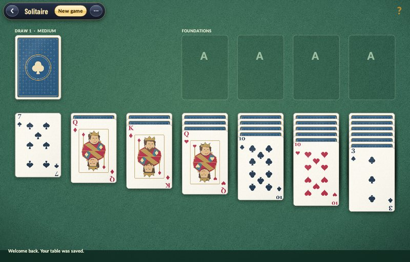</a>
<br><b><a href="games/solitaire">Solitaire</a></b> · Klondike patience
<br>Classic Klondike on billiard felt, drawing one card or three. Every deal at Easy, Medium and Hard is verified winnable before it reaches you, and a finished game ends with the bouncing-card cascade.
</td>
<td width="50%" valign="top">
<a href="games/spider">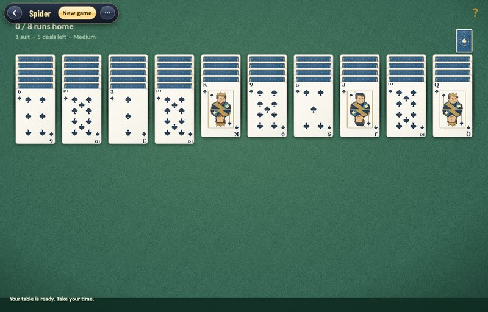</a>
<br><b><a href="games/spider">Spider</a></b> · Patience
<br>Ten columns with one, two or four suits: complete eight king-to-ace runs of a single suit. Deals are verified winnable at every difficulty.
</td>
</tr>
<tr>
<td width="50%" valign="top">
<a href="games/freecell">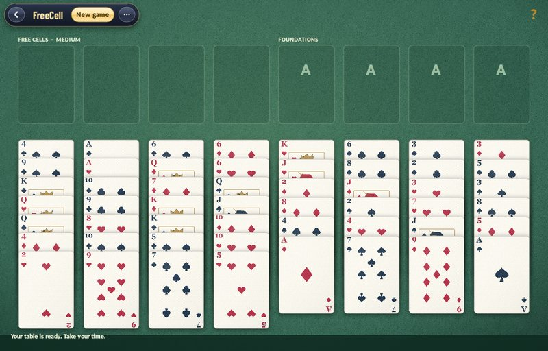</a>
<br><b><a href="games/freecell">FreeCell</a></b> · Patience
<br>Four free cells, every card face up, and nothing hidden but the plan. PlaySuite deals only verified winnable games, graded Easy, Medium and Hard.
</td>
<td width="50%" valign="top">
<a href="games/hearts">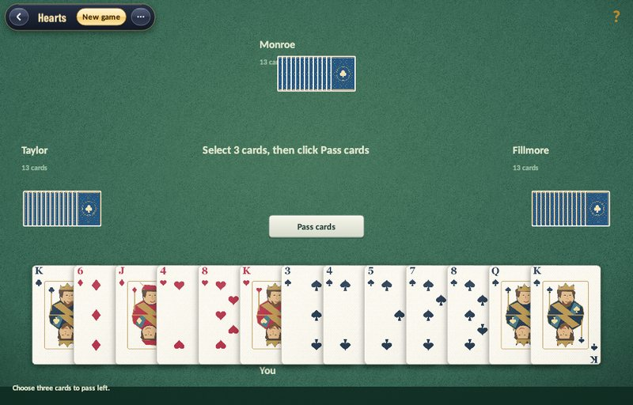</a>
<br><b><a href="games/hearts">Hearts</a></b> · Card table
<br>Hearts against three opponents named for US presidents. They track the cards played and guess at hidden hands; each hand one is sharp and one is forgetful. Pass, dodge the points, or shoot the moon.
</td>
</tr>
<tr>
<td width="50%" valign="top">
<a href="games/sudoku">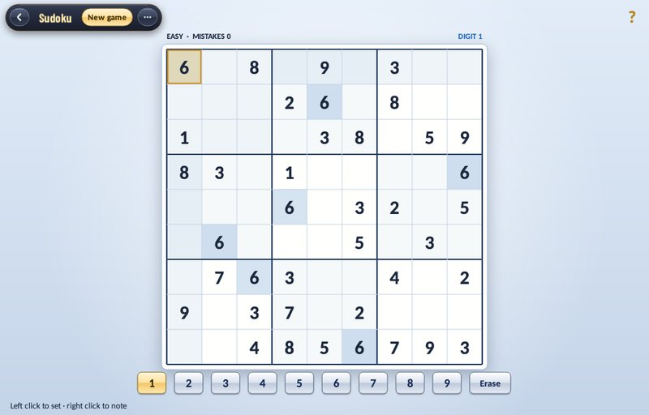</a>
<br><b><a href="games/sudoku">Sudoku</a></b> · Number logic
<br>Fresh, unique puzzles generated offline at three difficulties, with pencil notes, digit highlighting and a night mode. Top scores rank by fewest mistakes.
</td>
<td width="50%" valign="top">
<a href="games/gems">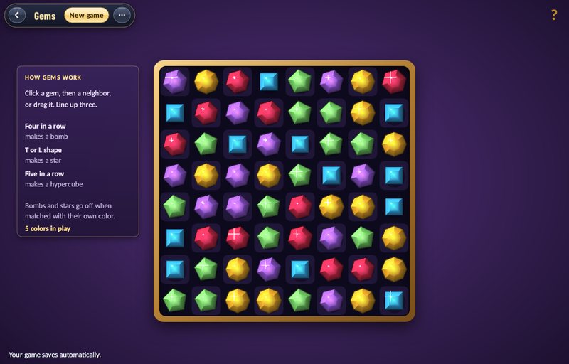</a>
<br><b><a href="games/gems">Gems</a></b> · Match three
<br>Faceted stones that pour in, breathe, follow the pointer when dragged and shatter. Line them up to make bombs, stars and hypercubes, with shockwaves, star beams and cascade call-outs.
</td>
</tr>
<tr>
<td width="50%" valign="top">
<a href="games/cube">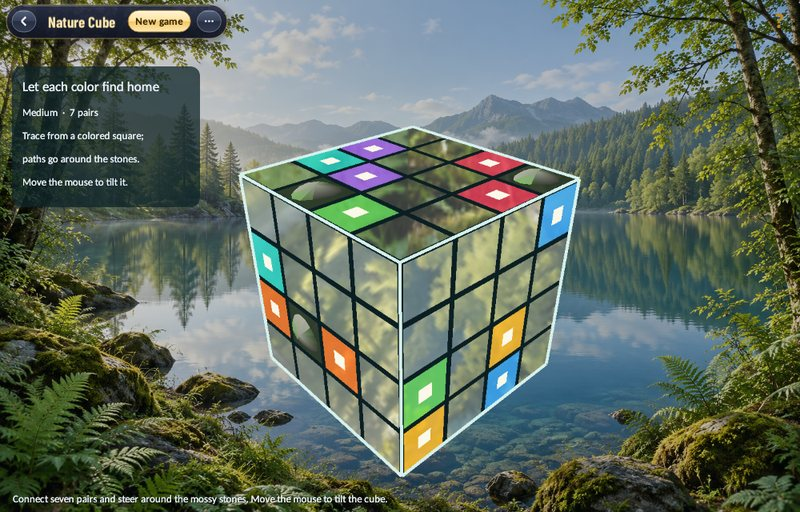</a>
<br><b><a href="games/cube">Nature Cube</a></b> · Path puzzle
<br>A block of dark glass with three playable faces of mirrored tiles reflecting a lake panorama. Join each coloured pair with paths that fold across the cube&#x27;s edges.
</td>
<td width="50%" valign="top">
<a href="games/untangle">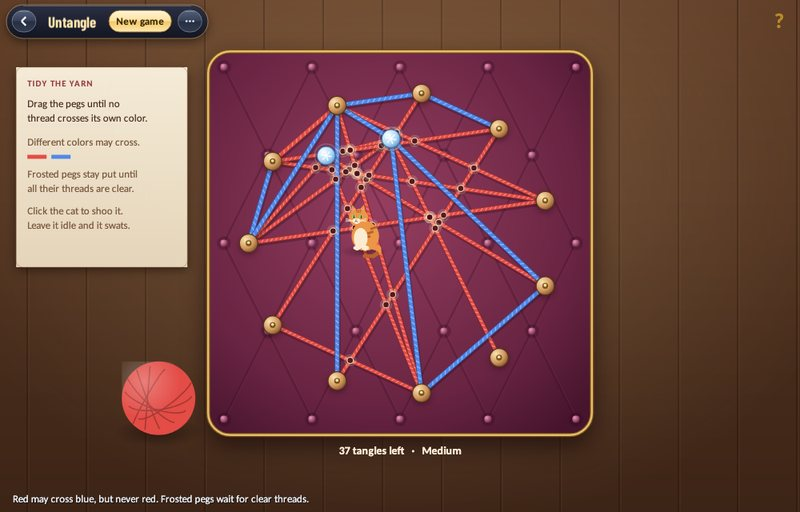</a>
<br><b><a href="games/untangle">Untangle</a></b> · Graph puzzle
<br>Yarn on a tufted cushion: drag the pegs until no thread crosses another of its colour. Frozen pegs and a cat who helps, hinders and finally naps in the finished web.
</td>
</tr>
<tr>
<td width="50%" valign="top">
<a href="games/atomprobe">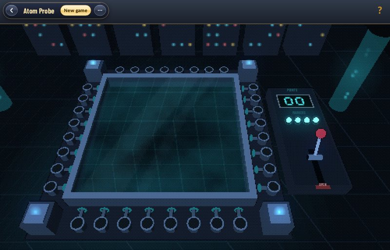</a>
<br><b><a href="games/atomprobe">Atom Probe</a></b> · Deduction
<br>Fire beams into a sealed, fogged chamber and read where they come out. Four atoms hide inside; deduce exactly where, for the fewest points.
</td>
<td width="50%" valign="top">
<a href="games/fourpegs">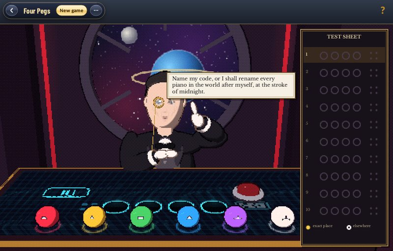</a>
<br><b><a href="games/fourpegs">Four Pegs</a></b> · Codebreaking
<br>Crack the Curator&#x27;s secret code of four coloured pegs in ten tries, reading the gold pins and white rings after every guess.
</td>
</tr>
<tr>
<td width="50%" valign="top">
<a href="games/switchbox">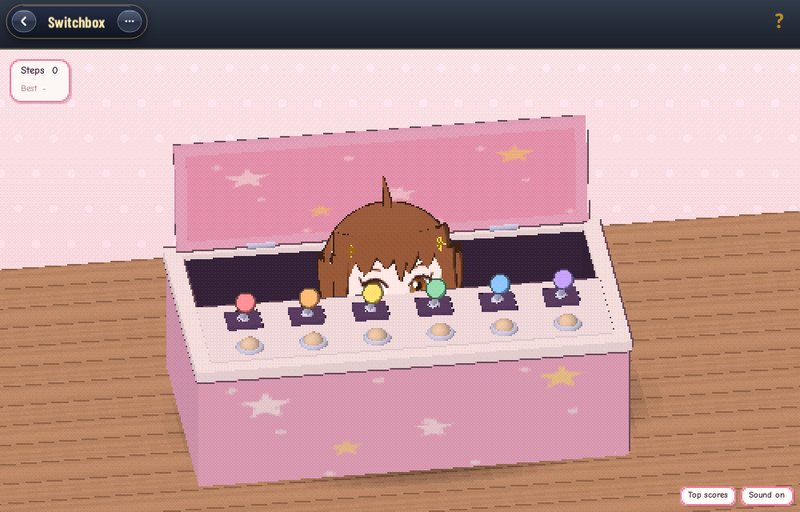</a>
<br><b><a href="games/switchbox">Switchbox</a></b> · Switch puzzle
<br>She lives in the box, and those are her switches. Find the secret order that lights all six lamps; flip the wrong one and every lamp goes dark.
</td>
<td width="50%" valign="top">
<a href="games/solve">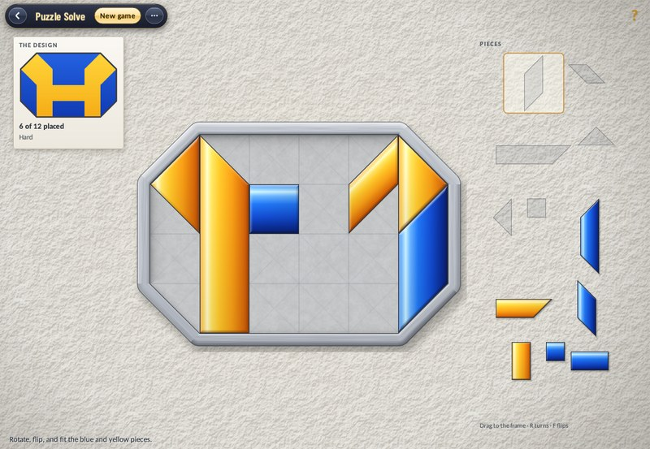</a>
<br><b><a href="games/solve">Puzzle Solve</a></b> · Reconstruction
<br>Turn and flip glass pieces to rebuild a blue and yellow design. Every design is cut from a real tiling of squares, octagons, hexagons and more, from four-piece lessons to twelve-piece puzzles, and any arrangement with the same colours counts.
</td>
</tr>
<tr>
<td width="50%" valign="top">
<a href="games/eggy">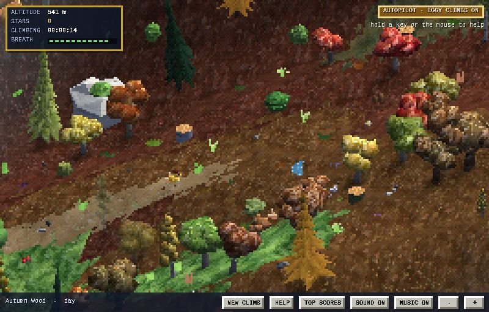</a>
<br><b><a href="games/eggy">Eggy</a></b> · A long climb
<br>Help a duckling climb the Very, Very Tall Mountain. Steer him or let him climb on his own; he never gives up, and keeps climbing while the game is closed.
</td>
<td width="50%" valign="top">
<a href="games/koikoi">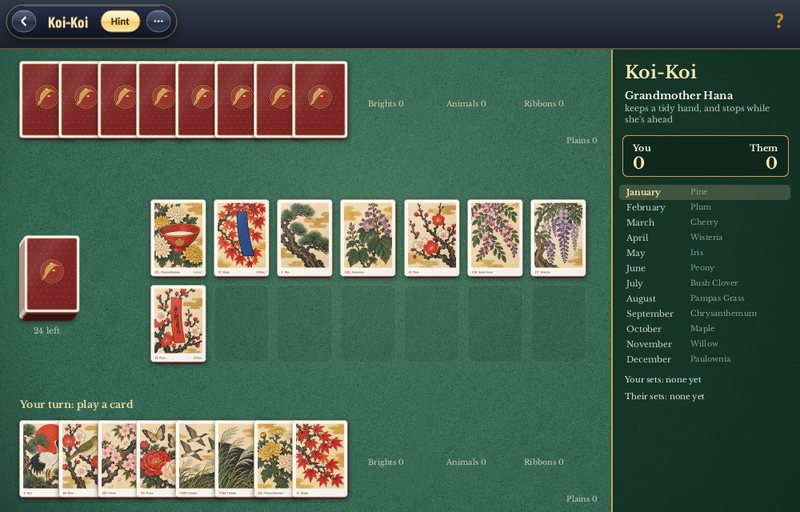</a>
<br><b><a href="games/koikoi">Koi-Koi</a></b> · Hanafuda
<br>The Japanese flower-card game, with 48 new woodblock-style card faces. Match the months, collect scoring sets, and decide when to stop or risk another turn with koi-koi.
</td>
</tr>
<tr>
<td width="50%" valign="top">
<a href="games/parrots">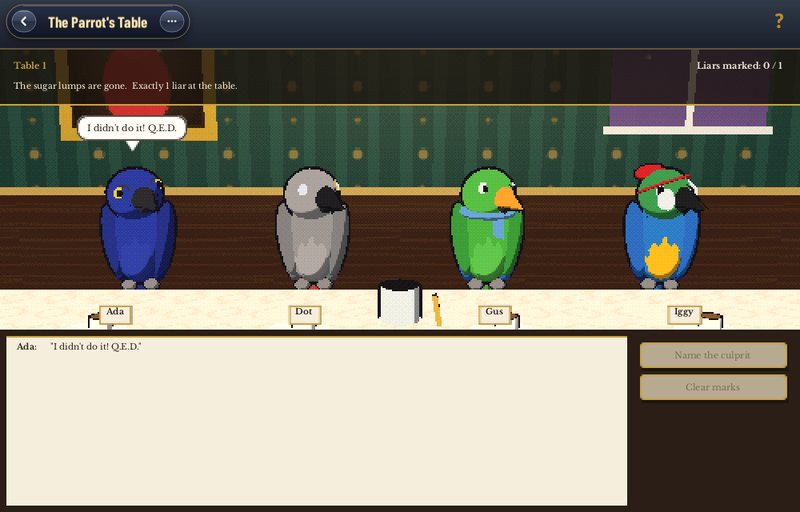</a>
<br><b><a href="games/parrots">The Parrot&#x27;s Table</a></b> · Deduction
<br>Every parrot is either honest or a liar, and one of them did the deed. Question them carefully and name the culprit by reasoning alone.
</td>
<td width="50%" valign="top">
<a href="games/liarsdice">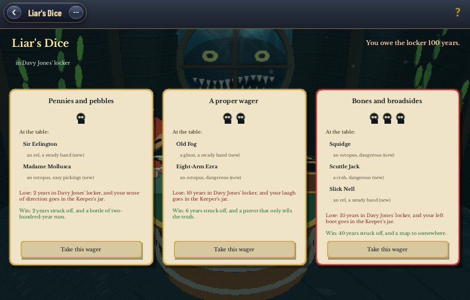</a>
<br><b><a href="games/liarsdice">Liar&#x27;s Dice</a></b> · Bluffing
<br>Bluffing dice in a pirate tavern. Read a crew with their own habits and tells, raise the bid, or call their bluff, and keep the Keeper&#x27;s jar from swallowing your dice.
</td>
</tr>
<tr>
<td width="50%" valign="top">
<a href="games/penthesheep">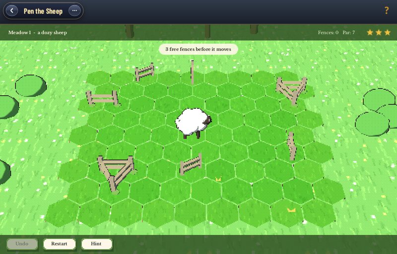</a>
<br><b><a href="games/penthesheep">Pen the Sheep</a></b> · Pasture puzzle
<br>Place fences one at a time while a sheep looks for the way out. Dozy, clever and cunning sheep each think differently; pen them at or under par for three stars.
</td>
<td width="50%" valign="top">
<a href="games/zenconstruction">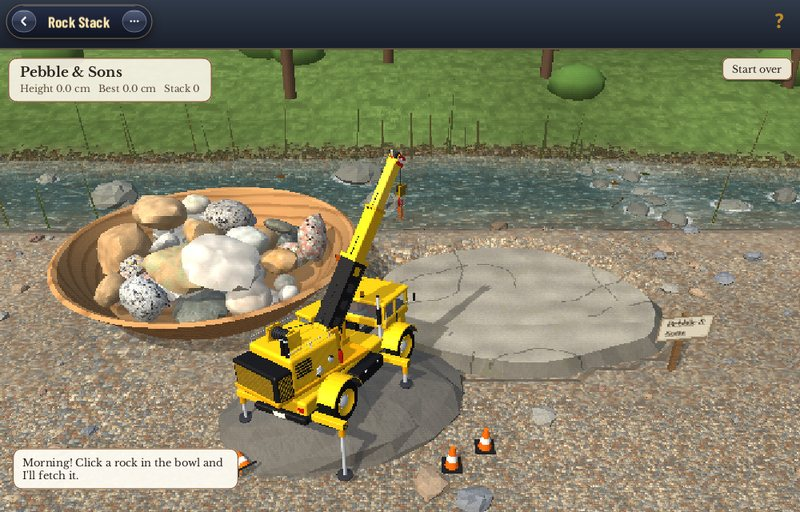</a>
<br><b><a href="games/zenconstruction">Rock Stack</a></b> · Stone construction
<br>Work a little crane beside a brook to stack river stones as high as they will stand. Every rock is generated, weighed and balanced by a real physics simulation.
</td>
</tr>
<tr>
<td width="50%" valign="top">
<a href="games/catchingthieves">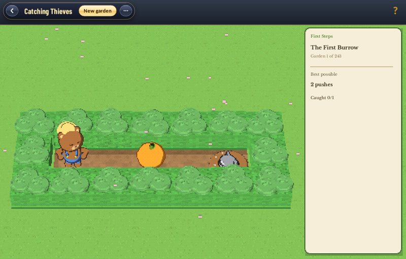</a>
<br><b><a href="games/catchingthieves">Catching Thieves</a></b> · Garden puzzle
<br>Push pumpkins over the burrows before the raccoon bandits raid the bear&#x27;s garden. 243 solver-verified gardens through the seasons, plus endless generated ones.
</td>
<td width="50%" valign="top">
<a href="games/maze">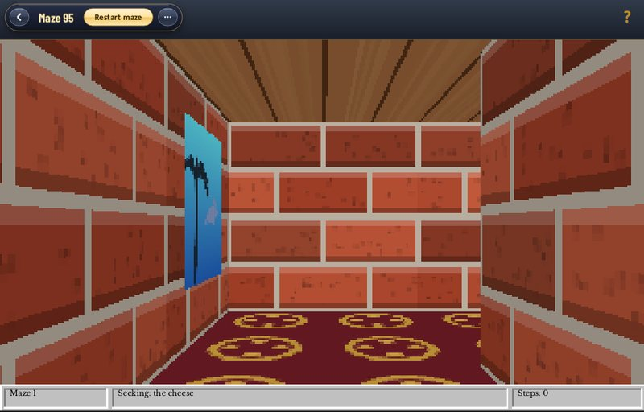</a>
<br><b><a href="games/maze">Maze 95</a></b> · First-person maze
<br>A first-person maze in the style of an old screensaver: brick corridors, ceiling flips, portals, a rolling marble and corridor visitors. Find the reward and fill your trophy shelf.
</td>
</tr>
<tr>
<td width="50%" valign="top">
<a href="games/stillwater">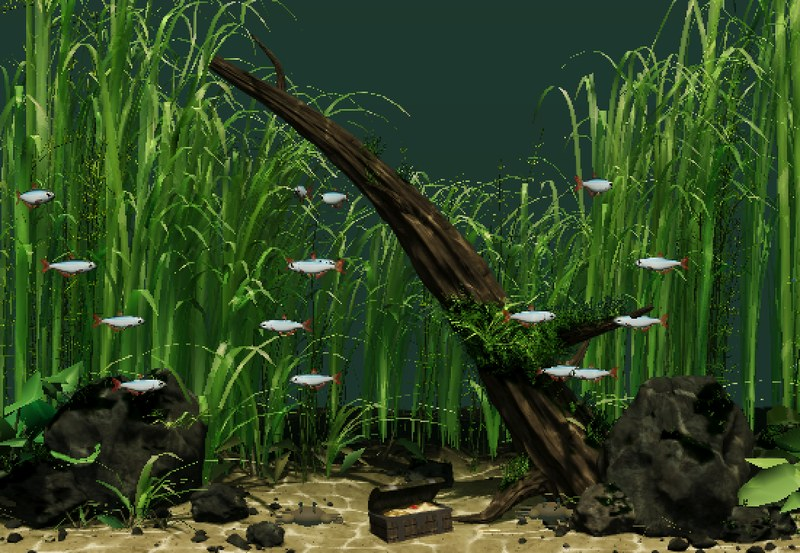</a>
<br><b><a href="games/stillwater">Stillwater</a></b> · Living aquarium
<br>A living aquarium to leave running: tetras over swaying grass, a coral reef of tangs and clownfish, or a dim river pool under tree roots, all under shifting sunlit caustics, with an island band improvising on lap steel and ukulele. Tap the glass to scatter the fish.
</td>
<td width="50%" valign="top">
<a href="games/mowingman">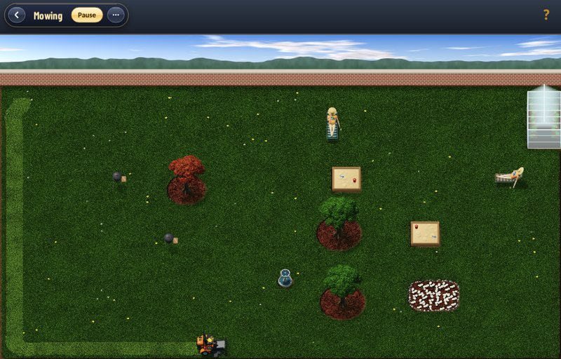</a>
<br><b><a href="games/mowingman">Mowing</a></b> · Garden mowing
<br>Eggy mows the garden on a ride-on mower, striping the lawn on his own. Take the wheel if you like, but keep off the flower beds or the old lady comes after you, and watch out for the gnome peeking from the grass.
</td>
</tr>
</table>
<!-- games:end -->

## Submit a game

[new-games/README.md](new-games/README.md) states the rules and requirements a game must meet and how to submit one. [new-games/AGENTS.md](new-games/AGENTS.md) is the procedure for building it, alone or with an AI model, and `new-games/` holds the template game and tools.

A game's folder holds everything about it: `GAME.json` (its identity on the shelf), its code, assets, help, tests and tools, `about.md` (its description on this page) and `screens/readme.jpg` (its picture here). This page's game list is regenerated from those files by `tools/make_readme.py`, automatically after every push to `main`.

## Build status and downloads

The [Build installable PlaySuite workflow](https://github.com/falseywinchnet/games/actions/workflows/applications.yml) builds the complete collection on native Windows x64, macOS arm64, Linux x64 and Linux arm64 runners, runs every application test on each, then installs and launches the Windows, macOS and Linux packages with isolated saves. A push to `main` that passes on all four publishes a new version to [Releases](https://github.com/falseywinchnet/games/releases). Tests include the command bar at the minimum 600 × 420 window size for every game.

Download installers and portable archives from [the latest release](https://github.com/falseywinchnet/games/releases/latest). macOS packages target Apple silicon and macOS 15 or later and are signed ad hoc, without Developer ID notarization. Linux packages target Ubuntu 24.04 or compatible systems and require X11.

PlaySuite links reviewed GUI.Forms source for native windows, portable text and audio (including live synthesized voices); no development SDK is installed or exported. CMake fetches pinned QuickJS for offline Sudoku. No external JavaScript runtime or server is needed. FFmpeg and Pillow prepare release assets and are not runtime requirements. See [complete build instructions](docs/BUILDING.md).

The smaller portable-core profile builds every game's rules and simulation without the application, and is useful for rules and numerical work:

```sh
cmake -S . -B build -G Ninja -DCMAKE_BUILD_TYPE=Release -DGAMES_BUILD_APPLICATION=OFF
cmake --build build --parallel 4
ctest --test-dir build --output-on-failure --timeout 180
```

## Saves and scores

Every game saves committed changes, keeps its own position when switching games, resumes on reopening, and offers its own restart, next-round or new-game controls. Saves live in `%APPDATA%/Rainstar/Games` on Windows, `~/Library/Application Support/Rainstar/Games/` on macOS, and `$XDG_STATE_HOME/rainstar/games` (default `~/.local/state/rainstar/games`) on Linux. These folders keep their earlier names so existing saves carry over to PlaySuite. `GAMES_STATE_DIR` overrides this for isolated tests. Files use bounded, checksummed envelopes and atomic replacement. Undo history is session-local; current boards, Sudoku notes and mistakes, puzzle progress, and named scores persist.

Terminal results open a named arcade-style top-score window, keeping the best ten results per game and rules profile; a saved submission latch prevents the same result from being entered twice. Games with their own records keep them too: Koi-Koi's twelve-round match scoreboard, The Parrot's Table's solved tables and streaks, Liar's Dice's ledger and crew records, Pen the Sheep's meadow stars, and Eggy's time-and-stars list.

Music, Sound and Motion are shared master controls on the shelf sign and in every game's capsule; M mutes or unmutes music throughout the collection. A plain ? in the top-right corner, H, or F1 opens a shared paper-style help document at the current game.

## Source layout

- [`games/<id>/`](games): one folder per game, discovered from its `GAME.json`: factory, cover, help, build rules, code, assets, tests, `about.md` and screenshots.
- [`shared/`](shared): code several games use. `cards/` is the card engine (rules, table, solver and the graded deal tables) behind Solitaire, Spider, FreeCell and Hearts; `puzzles/` the puzzle models, view and renderer behind Gems, Nature Cube, Untangle and Puzzle Solve; `ambient/` the retained 3D scene engine behind Stillwater and Mowing; `coverage/` Mowing's coverage planner; `felt/` the card-table felt generator.
- [`src/`](src): the PlaySuite shell and its services: the shelf, boxes and launch transition (`collection`, `shelf`, `suite`), the command capsule, help, storage and scores, portable audio and text, presentation helpers and `main`.
- [`authoring/playsuite_music/`](authoring/playsuite_music): the synthesizer and scores for the menu theme and the card, Sudoku, Gems, Nature Cube, Untangle and Puzzle Solve music.
- [`new-games/`](new-games): the kit for making a new game.

See [the game catalog](docs/GAME_CATALOG.md) for exact rules and provenance, [validation](docs/VALIDATION.md) for evidence and limitations, [audio integration](docs/AUDIO_INTEGRATION.md), [source references](docs/SOURCE_REFERENCES.md), [the owner handoff](docs/OWNER_MODULE_HANDOFF.md) and [Eggy integration](docs/EGGY_INTEGRATION.md).
